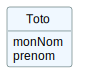

= Diagrammes de classes avec plantUML
Jean-Michel Bruel <jbruel@gmail.com>
//v1, 2022-02-19 : Initial draft
v1.1, 2022-02-19 : Add template for Maven
:icons: font
:diagrams: .
:experimental:
:classroom-link: https://classroom.github.com/a/4var6sCc

// Useful definitions
:asciidoc: http://www.methods.co.nz/asciidoc[AsciiDoc]
:icongit: icon:git[]
:git: http://git-scm.com/[{icongit}]
:plantuml: https://plantuml.com/fr/[plantUML]
:vscode: https://code.visualstudio.com/[VS Code]

// Specific to GitHub
ifdef::env-github[]
:toc:
:tip-caption: :bulb:
:note-caption: :information_source:
:important-caption: :heavy_exclamation_mark:
:caution-caption: :fire:
:warning-caption: :warning:
:icongit: Git
endif::[]

// Tags
image:https://classroom.github.com/assets/open-in-vscode-f059dc9a6f8d3a56e377f745f24479a46679e63a5d9fe6f495e02850cd0d8118.svg["Open in Visual Studio Code",link="https://classroom.github.com/online_ide?assignment_repo_id=7083920&assignment_repo_type=AssignmentRepo"]

Si ce lien ne fonctionne pas:

- Ouvrez Visual Studio Code
 
 - Ouvrez le menu "Source Control", puis cliquez sur "Clone Repository"

- Saisissez l'URL récupérée depuis le dépôt en ligne => bouton vert "Code" => "HTTPs" (ne pas prendre la version ssh)

- Sur les PC de l'IUT, annuler ou fermez les fenêtres qui vous demandent un login mot de passe, puis validez l'invitation, qui vous permettra de vous authentifier sur votre navigateur

//---------------------------------------------------------------

Ce TP vise à pratiquer la notation {plantuml} pour écrire vos diagrammes de classes (et tous les diagrammes UML du BUT).

== Mise en place

Si vous lisez ce document c'est que vous avez réalisé la manipulation suivante :

. Vous avez créé un dépôt en cliquant sur le lien : {classroom-link}
. Vous avez ouvert ce fichier dans votre {vscode} (si vous l'avez sur votre machine) ou sur la version en ligne via gitpod (recommandé pour un premier TP , surtout si vous ne connaissez pas {git}).

Pour lancer un EDI directement sur le web depuis votre dépôt {git} :

image::images/gitpod.png["Gidpod access", width=90%]
image::images/gitpod2.png["Gidpod access", width=90]
image::images/gitpod3.png["Gidpod access", width=90%]
image::images/gitpod4.png["Gidpod access", width=90%]

WARNING: Vérifiez bien que vous n'avez pas ouvert le dépôt d'un autre étudiant, nous avons des soucis avec les _credentials_ git qui ne se ré-initialisent pas au redémarrage des machines.

== Plugin PlantUML

.Interpréteur PlantUML en action
image::images/plantuml1.png["PlantUML plugin", width=90%]

Pour pouvoir observer directement vos modèles graphiquement au fur et à mesure que vous tapez du code, il vous faut un interpréteur pour votre EDI.

Sur {vscode}, que ce soit en ligne ou sur votre machine, s'il n'est pas installé, allez dans l'espace des plugins et ajoutez celui dédié à {plantuml} :

image::images/plantuml2.png["PlantUML plugin", width=50%]

Une fois le plugin installé, le raccourci "Alt + D" (ou Option + D) permet de générer le diagramme PlantUML depuis votre fichier PlantUML. 

== PlantUML

Explorez rapidement le site de {plantuml} pour vous familiariser avec son organisation. Observez les exemples de code et les rendus correspondants.

== Consignes et rendus

Pour ce TP, il vous faudra produire pour chacune des figures du `TD3.html` (dont vous avez également le source `TD3.adoc`) fourni dans ce dépôt et dont voici la liste :

- [ ] td3-1
- [ ] td3-2
- [ ] td3-3
- [ ] td3-4
- [ ] td3-5
- [ ] td3-6
- [ ] td3-7

== Initiation à Git

Le dépôt GitHub qui a été créé n'est pas un simple "Google Drive" ou répertoire "Dropbox".
Il faut "synchroniser" les changements entre votre travail (local) et votre dépôt (distant).
Comme vu en cours, selon que vous modifiez vos fichiers sur l'un de ces environnement de travail, il vous faudra adapter votre façon de "pousser" vos modifications :

- le dépôt lui-même (via un navigateur web)
- un editeur en ligne qui a cloné votre dépôt (comme le fait GitPod)
- l'éditeur de votre machine qui travaille sur une version locale (clonée de votre dépôt 

TIP: Pour ceux qui veulent prendre de l'avance sur {git}, vous pouvez utiliser le support de cours disponible ici : https://bit.ly/jmb-git.

[appendix]
== Intérêt du format plantUML

Outre que vous avez l'impression de "coder" vos diagrammes (utilisation de variables, séparation du fond et de la forme, ...), l'intérêt est que ces notations textuelles s'insèrent directement dans de l'asciidoc (format de ce fichier par exemple).

ifndef::env-github[]
.Exemple de diagramme directement rendu par l'interpréteur asciidoc
[plantuml, format="svg", target="test", width="80%"]
----
include::{diagrams}/test.plantuml[]
----
endif::[]

ifdef::env-github[]
.Exemple de diagramme directement intégré en image

endif::[]

[WARNING]
====
GitHub utilise son propre moteur de rendu {asciidoc}, d'où les nombreuses clauses conditionnelles dans ce fichier, qui permettent d'avoir à peu près le même rendu que vous visionez la version HTML (générée par la commande `asciidoctor -r asciidoctor-diagram README.adoc`, que vous pouvez testez dans votre terminal) ou la version GitHub de ce rendu.
====

CAUTION: Si vous utilisez la version en ligne de {vscode} il vous faut exécuter la commande `bundle` pour installer les outils {asciidoc}.

[appendix]
== Soucis éventuels de connexion à distance

image::images/git-access.png[]

Si vous ne pouvez pas synchroniser votre dépôt avec GitPod, des fichiers .svg seront automatiquements créés lorsque vous pushez du code.

